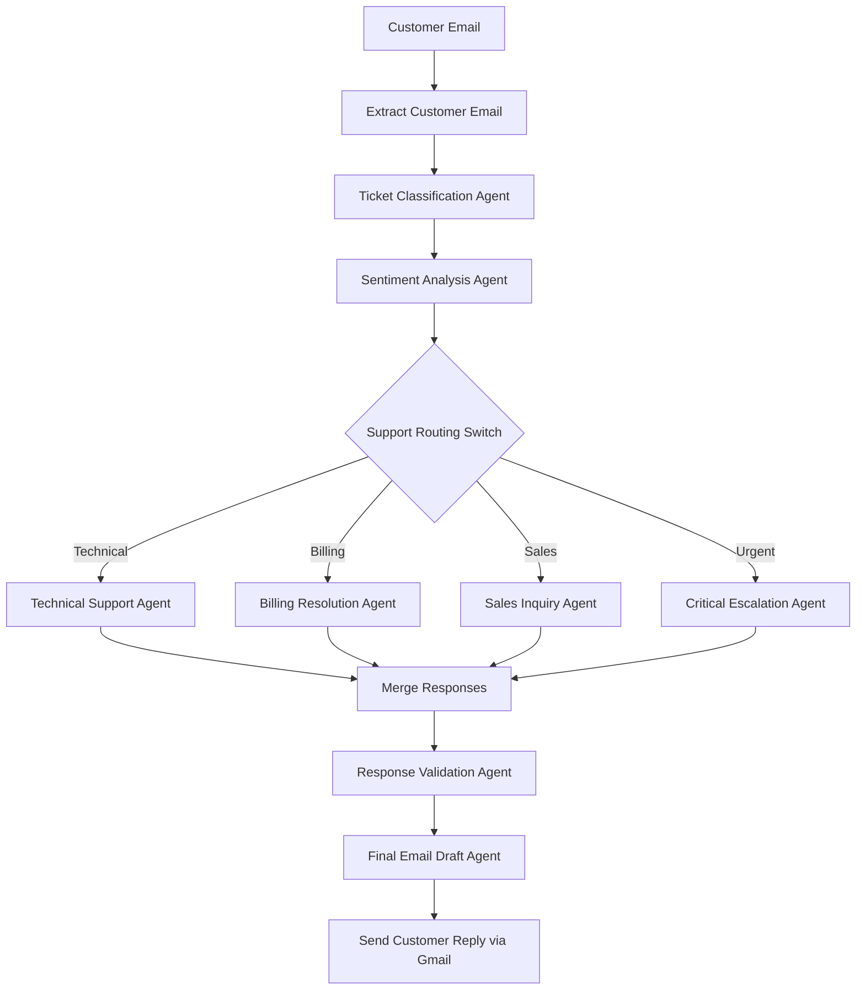

# AI-Powered Multi-Agent Customer Support Orchestration System

## Project Overview

The AI-Powered Multi-Agent Customer Support Orchestration System is an Agentic AI workflow developed using n8n to automate the end-to-end customer support process.

Modern businesses receive a large volume of customer emails related to technical issues, billing concerns, product inquiries, subscription problems, and urgent escalations. Manually handling these requests is time-consuming, expensive, and often results in inconsistent customer experiences.

This workflow leverages multiple specialized AI agents that collaborate to analyze customer emails, classify requests, assess sentiment, route tickets to the appropriate support expert, generate responses, validate quality, and prepare professional customer-facing emails.

Rather than relying on a single AI prompt, the workflow follows an agentic design pattern where each AI agent is assigned a specific responsibility. This improves scalability, maintainability, accuracy, and transparency.

---

# Problem Statement

Customer support teams often face challenges such as:

* Large volumes of incoming support requests
* Delayed response times
* Manual ticket triaging
* Inconsistent customer communication
* Difficulty identifying urgent cases
* Lack of standardized support workflows

Organizations need a system that can intelligently understand customer issues, prioritize requests, route them appropriately, and generate high-quality responses while reducing manual effort.

This project addresses these challenges through a multi-agent AI workflow capable of automating the support lifecycle.

---

# Target Users

### Primary Users

* Customer Support Teams
* Support Managers
* SaaS Companies
* Product-Based Companies
* Service-Based Organizations

### Secondary Users

* Customers seeking support
* Operations Teams
* Customer Success Teams

---

# Workflow Goal

The primary goal of this workflow is to automate customer support operations while maintaining response quality.

The system should:

* Understand incoming customer emails
* Classify support tickets
* Determine urgency levels
* Analyze customer sentiment
* Route requests to appropriate specialists
* Generate accurate responses
* Validate generated outputs
* Create professional customer-ready emails

---

# Expected Output

For every incoming customer request, the workflow generates:

* Ticket Classification
* Priority Level
* Sentiment Analysis
* Escalation Risk Assessment
* Domain-Specific Resolution
* Quality-Validated Response
* Final Professional Email Draft

---

## System Architecture




---

# Workflow Components

## 1. Extract Customer Email

This node extracts:

* Sender Email
* Subject
* Email Body
* Timestamp
* Thread ID

This information serves as the primary input for downstream agents.

---

## 2. Ticket Classification Agent

### Role

Customer Support Classifier

### Purpose

Analyze the incoming customer request and determine:

* Support Category
* Priority
* Issue Summary
* Customer Intent

### Categories

* Technical
* Billing
* Sales
* Urgent

### Output Example

```json
{
  "category": "billing",
  "summary": "Customer charged twice",
  "priority": "high",
  "intent": "request_refund"
}
```

---

## 3. Sentiment Analysis Agent

### Role

Customer Emotion Analyst

### Purpose

Understand the emotional state of the customer.

### Responsibilities

* Sentiment Detection
* Emotional Tone Analysis
* Frustration Assessment
* Escalation Risk Identification

### Output Example

```json
{
  "sentiment": "frustrated",
  "emotionalTone": "concerned",
  "frustrationLevel": "high",
  "escalationRisk": "medium"
}
```

---

## 4. Support Routing Switch

### Type

Deterministic Node

### Purpose

Route tickets to specialized support agents based on classification results.

Routing Rules:

Technical → Technical Support Agent

Billing → Billing Resolution Agent

Sales → Sales Inquiry Agent

Urgent → Critical Escalation Agent

This node demonstrates deterministic workflow control.

---

## 5. Specialized Support Agents

### Technical Support Agent

Handles:

* Login Problems
* Software Bugs
* Technical Errors
* Configuration Issues

Generates troubleshooting and resolution steps.

---

### Billing Resolution Agent

Handles:

* Refund Requests
* Subscription Issues
* Payment Failures
* Invoice Queries

Generates billing-specific responses.

---

### Sales Inquiry Agent

Handles:

* Pricing Questions
* Product Information
* Feature Requests
* Demo Requests

Generates sales-oriented responses.

---

### Critical Escalation Agent

Handles:

* High-Risk Customers
* Critical Issues
* Legal Concerns
* Data Loss Reports

Provides urgent escalation responses.

---

## 6. Response Validation Agent

### Role

Quality Assurance Reviewer

### Purpose

Review AI-generated responses before delivery.

Checks:

* Professionalism
* Clarity
* Empathy
* Hallucination Risk
* Policy Compliance

This acts as a quality-control layer.

---

## 7. Final Email Draft Agent

### Purpose

Transform validated responses into customer-ready emails.

The generated email includes:

* Greeting
* Response Body
* Resolution Details
* Next Steps
* Professional Closing

---

## 8. Gmail Integration

The final response is delivered through Gmail integration.

This represents the final action stage of the workflow.

---

# AI vs Deterministic Logic

## AI-Based Components

The following nodes require reasoning and language understanding:

* Ticket Classification Agent
* Sentiment Analysis Agent
* Technical Support Agent
* Billing Resolution Agent
* Sales Inquiry Agent
* Critical Escalation Agent
* Response Validation Agent
* Final Email Draft Agent

These agents perform classification, interpretation, response generation, validation, and communication tasks.

---

## Deterministic Components

The following components use predefined workflow logic:

* Support Routing Switch
* Workflow Sequencing
* Branching Logic
* Agent Selection

Deterministic nodes ensure predictable workflow execution.

---

# Agentic AI Concepts Demonstrated

This project demonstrates several core Agentic AI principles:

### Task Decomposition

The problem is divided into smaller specialized tasks.

### Role-Based Agents

Each agent has a dedicated responsibility.

### Structured Outputs

Agents generate structured JSON outputs.

### Routing and Branching

Tickets are dynamically routed to appropriate agents.

### Agent Collaboration

Multiple agents contribute to the final result.

### Validation Layer

Generated responses are reviewed before delivery.

### AI and Deterministic Separation

Reasoning tasks are handled by AI while control logic remains deterministic.

---

# Technologies Used

* n8n
* OpenAI GPT-4o Mini
* Gmail Integration
* Structured Output Parser
* Multi-Agent Workflow Design

---


# Future Improvements

* Human Approval Layer
* Slack Escalation Notifications
* CRM Integration
* Knowledge Base Integration
* Analytics Dashboard
* Customer Ticket History Tracking
* Google Sheets Logging

---

# Author

Vinay Reddy, 10083

Agentic Workflow Design and n8n Demo Assignment
