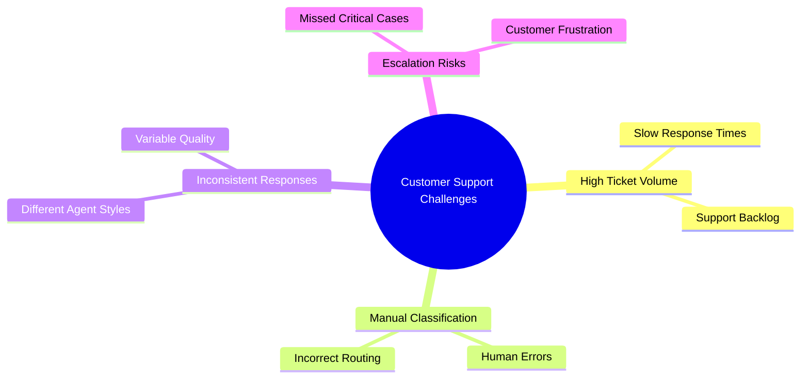

# Problem Statement

## Project Title

AI-Powered Multi-Agent Customer Support Orchestration System

### User

The primary users of this system are customer support teams, support managers, SaaS companies, and businesses that handle large volumes of customer support requests through email.

### Pain Point

Modern organizations receive numerous customer emails every day related to technical issues, billing concerns, refund requests, product inquiries, subscription problems, and urgent escalations.

Support teams must manually read each email, understand the issue, determine its priority, route it to the appropriate department, draft a response, and ensure the response is accurate before sending it back to the customer.

As ticket volumes increase, this process becomes difficult to manage and often leads to slower response times, inconsistent communication, incorrect ticket routing, and reduced customer satisfaction.

#### Challenges in Traditional Customer Support

### Workflow Goal

The goal of this workflow is to automate the customer support lifecycle using a multi-agent AI architecture.

The workflow should:

1. Analyze incoming customer emails.
2. Classify support requests into appropriate categories.
3. Detect customer sentiment and escalation risk.
4. Route requests to specialized support agents.
5. Generate domain-specific responses.
6. Validate response quality and accuracy.
7. Produce professional customer-ready email drafts.

By decomposing the problem into multiple specialized AI agents, the workflow improves efficiency, consistency, and scalability compared to traditional support processes.

### Expected Output

For every customer support email, the workflow generates:

* Ticket Category
* Priority Level
* Customer Intent
* Sentiment Analysis
* Escalation Risk Assessment
* Specialist Support Response
* Validated Response
* Professional Customer Email Draft

The final output is a high-quality customer-ready support response that can be delivered quickly and consistently while significantly reducing manual effort.
