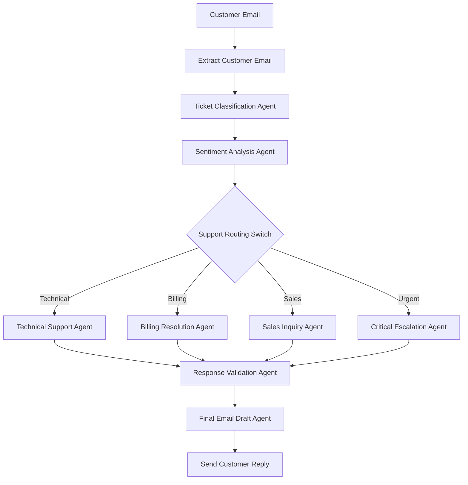
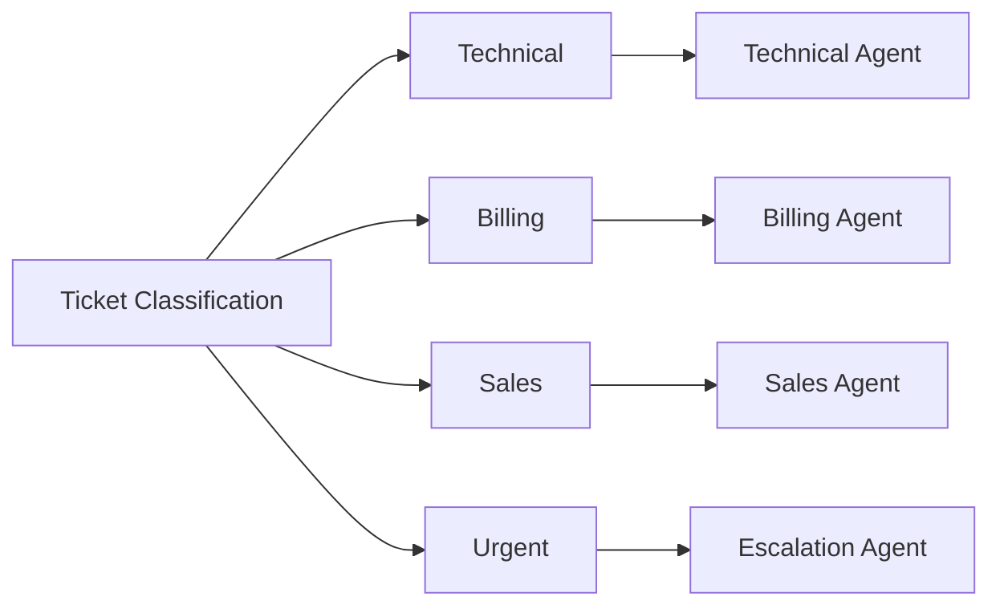

# Workflow Explanation

## Workflow Overview

The AI-Powered Multi-Agent Customer Support Orchestration System automates the customer support lifecycle by combining multiple specialized AI agents with deterministic workflow control.

The workflow receives a customer support email, analyzes the request, identifies customer intent and sentiment, routes the request to the appropriate specialist agent, validates the generated response, and produces a professional customer-ready email.



---

## Major Workflow Steps

| Step | Component                   | Purpose                                                                                |
| ---- | --------------------------- | -------------------------------------------------------------------------------------- |
| 1    | Extract Customer Email      | Extracts sender information, subject, email content, and metadata.                     |
| 2    | Ticket Classification Agent | Identifies ticket category, priority level, issue summary, and customer intent.        |
| 3    | Sentiment Analysis Agent    | Determines customer sentiment, frustration level, emotional tone, and escalation risk. |
| 4    | Support Routing Switch      | Routes tickets to the appropriate specialist agent using predefined business rules.    |
| 5    | Specialist Support Agents   | Generate domain-specific responses based on the ticket category.                       |
| 6    | Response Validation Agent   | Reviews generated responses for quality, professionalism, clarity, and compliance.     |
| 7    | Final Email Draft Agent     | Converts the validated response into a professional customer-facing email.             |
| 8    | Gmail Delivery              | Sends the final response to the customer.                                              |

---

## AI Nodes

The following nodes use Large Language Models to perform reasoning and decision-making tasks:

### Ticket Classification Agent

Responsible for:

* Ticket Categorization
* Priority Detection
* Intent Recognition
* Issue Summarization

### Sentiment Analysis Agent

Responsible for:

* Sentiment Detection
* Emotional Tone Analysis
* Frustration Assessment
* Escalation Risk Evaluation

### Specialist Support Agents

#### Technical Support Agent

Handles technical troubleshooting and support requests.

#### Billing Resolution Agent

Handles refunds, subscriptions, invoices, and payment-related concerns.

#### Sales Inquiry Agent

Handles pricing questions, product information requests, and sales-related inquiries.

#### Critical Escalation Agent

Handles urgent support issues requiring immediate attention.

### Response Validation Agent

Acts as a quality assurance layer by checking:

* Professionalism
* Clarity
* Accuracy
* Empathy
* Policy Compliance

### Final Email Draft Agent

Generates a polished customer-facing response ready for delivery.

---

## Deterministic Nodes

The workflow uses deterministic logic for workflow control and execution.

### Support Routing Switch

This node routes tickets based on predefined business rules.

Routing Rules:

```text
Technical → Technical Support Agent

Billing → Billing Resolution Agent

Sales → Sales Inquiry Agent

Urgent → Critical Escalation Agent
```

Unlike AI nodes, this logic is predictable and rule-based.

---

## Branching Structure

The workflow uses category-based branching to ensure that every customer request is handled by the most appropriate specialist.



This branching mechanism improves response relevance and ensures domain-specific expertise.

---

## Final Output

For every customer support email, the workflow generates:

* Ticket Category
* Priority Level
* Customer Intent
* Sentiment Analysis
* Escalation Risk Assessment
* Specialist Resolution
* Validated Response
* Professional Email Draft

The final result is a customer-ready support response that can be delivered automatically while maintaining quality, consistency, and professionalism.

---

## Agentic AI Concepts Demonstrated

This workflow demonstrates several core Agentic AI principles:

* Task Decomposition
* Role-Based Agents
* Structured Outputs
* Routing and Branching
* Multi-Agent Collaboration
* Validation Layer
* AI and Deterministic Logic Separation
* Workflow Orchestration

By distributing responsibilities across multiple specialized agents, the system achieves greater scalability, explainability, and maintainability compared to a single-prompt solution.
